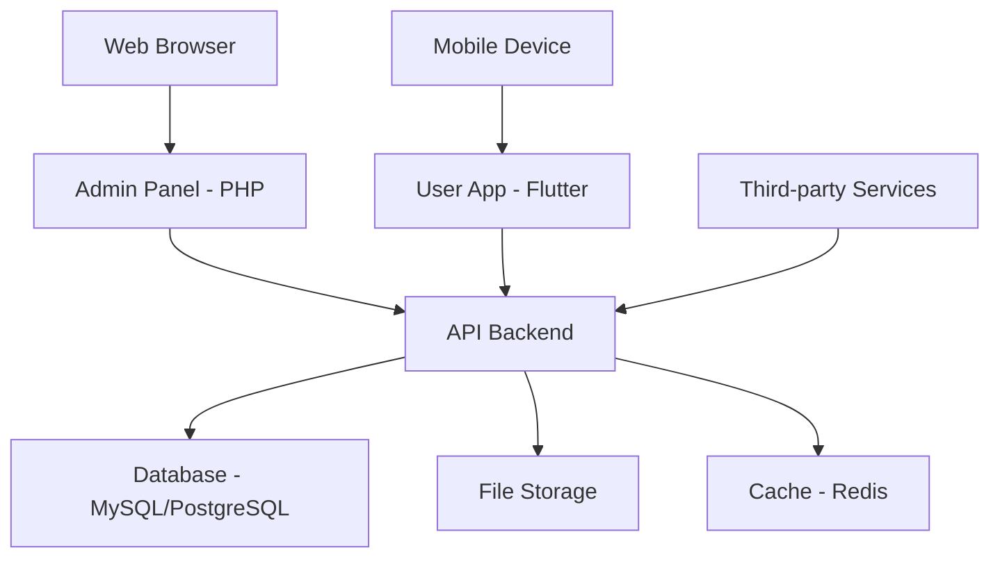

# Cihuy Platform - Complete Documentation

[](https://cihuy.com)
[](LICENSE)
[](docs/)

Platform Cihuy adalah solusi lengkap yang terdiri dari sistem admin web dan aplikasi mobile untuk mengelola dan mengakses layanan digital.

## Daftar Isi

- [Overview](#overview)
- [Architecture](#architecture)
- [Quick Start](#quick-start)
- [Documentation](#documentation)
- [Development](#development)
- [Deployment](#deployment)
- [Contributing](#contributing)
- [Support](#support)

## Overview

Cihuy Platform menyediakan ekosistem lengkap untuk:

- **Admin Panel**: Sistem manajemen web untuk administrator
- **User App**: Aplikasi mobile untuk end users
- **API Backend**: RESTful API yang menghubungkan kedua platform
- **Database**: Sistem penyimpanan data terpusat

### Key Features
- **Authentication & Authorization**: Sistem keamanan terintegrasi
- **Analytics & Reporting**: Dashboard dan laporan real-time
- **Cross-Platform**: Web admin + Mobile app
- **Real-time Sync**: Sinkronisasi data antar platform
- **Responsive Design**: Optimal di semua perangkat

## Architecture



### Technology Stack

#### Backend (Admin Panel)
- **Language**: PHP 8.0+
- **Framework**: Laravel/CodeIgniter/Native PHP
- **Database**: MySQL 8.0+ / PostgreSQL 13+
- **Web Server**: Apache 2.4+ / Nginx 1.18+
- **Cache**: Redis / Memcached

#### Frontend (User App)
- **Framework**: Flutter 3.0+
- **Language**: Dart 3.0+
- **Platforms**: Android, iOS, Web
- **State Management**: Provider/Riverpod/Bloc
- **Local Storage**: SQLite/Hive

#### Infrastructure
- **API**: RESTful API dengan JWT Authentication
- **File Storage**: Local/Cloud Storage (AWS S3, Google Cloud)
- **Monitoring**: Application logs dan performance metrics
- **CI/CD**: GitHub Actions / GitLab CI

## Quick Start

### Prerequisites
- PHP 8.0+ dengan Composer
- Flutter SDK 3.0+
- MySQL 8.0+ atau PostgreSQL 13+
- Git 2.0+

### 1. Clone Repository
```bash
git clone https://github.com/cihuy/platform.git
cd cihuy
```

### 2. Setup Admin Panel
```bash
cd admin
composer install
cp .env.example .env
# Edit .env dengan konfigurasi database
php artisan migrate --seed
php artisan serve
```

### 3. Setup User App
```bash
cd user
flutter pub get
flutter run
```

### 4. Access Applications
- **Admin Panel**: http://localhost:8000
- **User App**: Running di device/emulator
- **API Documentation**: `docs/API.md`

## Documentation

### Complete Documentation
- **[Admin Panel](admin/README.md)** - Panduan lengkap sistem admin
- **[User App](user/README.md)** - Panduan lengkap aplikasi mobile
- **[API Reference](docs/API.md)** - Dokumentasi API endpoints
- **[Changelog](CHANGELOG.md)** - Catatan perubahan versi

### Target Audience
- **Developers**: Setup, development, dan deployment
- **End Users**: Panduan penggunaan aplikasi
- **System Administrators**: Konfigurasi dan maintenance
- **Project Managers**: Overview dan roadmap

### PDF Export
Untuk versi PDF dari dokumentasi:

#### Method 1: Manual (Recommended)
1. Buka file Markdown di editor (VSCode/Cursor)
2. Preview Markdown (Ctrl+Shift+V)
3. Print to PDF (Ctrl+P → Save as PDF)

#### Method 2: Automated Script
```bash
# Run conversion script
powershell -ExecutionPolicy Bypass -File convert-to-html.ps1

# Open HTML files in browser
powershell -ExecutionPolicy Bypass -File print-to-pdf.ps1
```

#### Method 3: Pandoc (Advanced)
```bash
# Install Pandoc first
pandoc README.md -o README.pdf --from gfm --pdf-engine=wkhtmltopdf
```

## Development

### Project Structure
```
cihuy/
├── admin/                 # PHP Admin Panel
│   ├── app/
│   ├── config/
│   ├── database/
│   ├── public/
│   └── README.md
├── user/                  # Flutter Mobile App
│   ├── lib/
│   ├── android/
│   ├── ios/
│   └── README.md
├── docs/                  # Documentation
│   ├── API.md
│   └── pdf/              # Generated PDFs
├── scripts/              # Utility scripts
│   ├── convert-to-html.ps1
│   └── print-to-pdf.ps1
├── .github/              # GitHub workflows
├── CHANGELOG.md
├── CONTRIBUTING.md
├── LICENSE
└── README.md
```

### Development Workflow
1. **Fork** repository
2. **Create** feature branch: `git checkout -b feature/amazing-feature`
3. **Develop** dengan mengikuti coding standards
4. **Test** perubahan secara menyeluruh
5. **Commit** dengan pesan yang jelas
6. **Push** ke branch dan buat Pull Request

### Coding Standards
- **PHP**: PSR-12 coding standards
- **Dart/Flutter**: Dart style guide
- **Git**: Conventional commits
- **Documentation**: Markdown dengan struktur yang jelas

### Testing Strategy
- **Unit Tests**: Business logic dan utilities
- **Integration Tests**: API endpoints dan database
- **E2E Tests**: Critical user flows
- **Performance Tests**: Load testing untuk API

## Deployment

### Environment Setup

#### Development
```bash
# Admin
APP_ENV=local
APP_DEBUG=true
DB_CONNECTION=mysql

# User App
DEBUG_MODE=true
API_BASE_URL=http://localhost:8000/api
```

#### Production
```bash
# Admin
APP_ENV=production
APP_DEBUG=false
DB_CONNECTION=mysql

# User App
DEBUG_MODE=false
API_BASE_URL=https://api.cihuy.com
```

### Deployment Checklist
- [ ] Environment variables configured
- [ ] Database migrations applied
- [ ] SSL certificates installed
- [ ] Web server configured
- [ ] Monitoring setup
- [ ] Backup strategy implemented
- [ ] Security headers configured
- [ ] Performance optimization applied

### CI/CD Pipeline

# .github/workflows/deploy.yml
name: Deploy to Production
on:
  push:
    branches: [main]

jobs:
  deploy:
    runs-on: ubuntu-latest
    steps:
      - uses: actions/checkout@v3
      - name: Deploy Admin Panel
        run: |
          cd admin
          composer install --no-dev
          php artisan migrate --force
      - name: Deploy User App
        run: |
          cd user
          flutter build apk --release
```

## Contributing

### How to Contribute
1. **Read** [CONTRIBUTING.md](CONTRIBUTING.md) untuk guidelines lengkap
2. **Check** [Issues](https://github.com/cihuy/platform/issues) untuk tugas yang tersedia
3. **Fork** repository dan buat branch feature
4. **Develop** dengan mengikuti coding standards
5. **Test** perubahan secara menyeluruh
6. **Submit** Pull Request dengan deskripsi yang jelas

### Code Review Process
- Semua kode harus di-review sebelum merge
- Pastikan semua tests pass
- Ikuti coding standards yang ditetapkan
- Update dokumentasi jika diperlukan

### Reporting Issues
- Gunakan [GitHub Issues](https://github.com/cihuy/platform/issues)
- Berikan detail reproduction steps
- Sertakan informasi sistem
- Lampirkan log yang relevan

## Project Status

### Current Version: 1.0.0
- Admin Panel (PHP) - Complete
- User App (Flutter) - Complete
- API Backend - Complete
- Documentation - Complete
- Testing - In Progress
- Performance Optimization - In Progress

### Roadmap
- [ ] **v1.1.0**: Advanced analytics dashboard
- [ ] **v1.2.0**: Real-time notifications
- [ ] **v1.3.0**: Multi-language support
- [ ] **v2.0.0**: Microservices architecture

## Support

### Documentation & Help
- **Full Documentation**: [docs.cihuy.com](https://docs.cihuy.com)
- **Bug Reports**: [GitHub Issues](https://github.com/cihuy/platform/issues)
- **Feature Requests**: [GitHub Discussions](https://github.com/cihuy/platform/discussions)

### Community & Contact
- **Email**: support@cihuy.com
- **Discord**: [Cihuy Community](https://discord.gg/cihuy)
- **Twitter**: [@CihuyPlatform](https://twitter.com/CihuyPlatform)
- **WhatsApp**: +62-xxx-xxx-xxxx

### Professional Support
- **Enterprise Support**: enterprise@cihuy.com
- **Custom Development**: dev@cihuy.com
- **Consulting Services**: consulting@cihuy.com

## License

This project is licensed under the MIT License - see the [LICENSE](LICENSE) file for details.

## Acknowledgments

- **Flutter Team** untuk framework mobile yang luar biasa
- **Laravel Team** untuk PHP framework yang powerful
- **Open Source Community** untuk kontribusi dan inspirasi
- **Beta Testers** untuk feedback dan bug reports

---

<div align="center">

**Made with love by Cihuy Team**

[](https://cihuy.com)
[](https://github.com/cihuy/platform)
[](https://discord.gg/cihuy)

</div>
