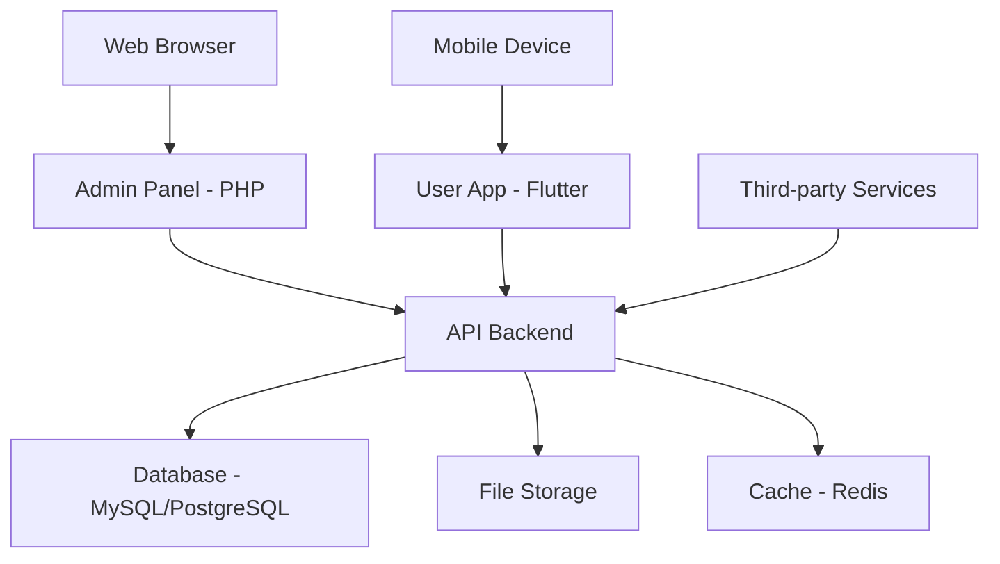

# Cihuy Platform - Complete Documentation

[](https://cihuy.com)
[](LICENSE)
[](docs/)

Platform Cihuy adalah solusi lengkap yang terdiri dari sistem admin web dan aplikasi mobile untuk mengelola dan mengakses layanan digital.

## 📋 Daftar Isi

- [Overview](#overview)
- [Architecture](#architecture)
- [Quick Start](#quick-start)
- [Documentation](#documentation)
- [Development](#development)
- [Deployment](#deployment)
- [Contributing](#contributing)
- [Support](#support)

## 🎯 Overview

Cihuy Platform menyediakan ekosistem lengkap untuk:

- **Admin Panel**: Sistem manajemen web untuk administrator
- **User App**: Aplikasi mobile untuk end users
- **API Backend**: RESTful API yang menghubungkan kedua platform
- **Database**: Sistem penyimpanan data terpusat

### Key Features
- 🔐 **Authentication & Authorization**: Sistem keamanan terintegrasi
- 📊 **Analytics & Reporting**: Dashboard dan laporan real-time
- 🌐 **Cross-Platform**: Web admin + Mobile app
- 🔄 **Real-time Sync**: Sinkronisasi data antar platform
- 📱 **Responsive Design**: Optimal di semua perangkat

## 🏗️ Architecture



### Technology Stack

#### Backend (Admin Panel)
- **Language**: PHP 8.0+
- **Framework**: Laravel/CodeIgniter/Native PHP
- **Database**: MySQL 8.0+ / PostgreSQL 13+
- **Web Server**: Apache 2.4+ / Nginx 1.18+
- **Cache**: Redis / Memcached

#### Frontend (User App)
- **Framework**: Flutter 3.0+
- **Language**: Dart 3.0+
- **Platforms**: Android, iOS, Web
- **State Management**: Provider/Riverpod/Bloc
- **Local Storage**: SQLite/Hive

#### Infrastructure
- **API**: RESTful API dengan JWT Authentication
- **File Storage**: Local/Cloud Storage (AWS S3, Google Cloud)
- **Monitoring**: Application logs dan performance metrics
- **CI/CD**: GitHub Actions / GitLab CI

## 🚀 Quick Start

### Prerequisites
- PHP 8.0+ dengan Composer
- Flutter SDK 3.0+
- MySQL 8.0+ atau PostgreSQL 13+
- Git 2.0+

### 1. Clone Repository
```bash
git clone https://github.com/cihuy/platform.git
cd cihuy
```

### 2. Setup Admin Panel
```bash
cd admin
composer install
cp .env.example .env
# Edit .env dengan konfigurasi database
php artisan migrate --seed
php artisan serve
```

### 3. Setup User App
```bash
cd user
flutter pub get
flutter run
```

### 4. Access Applications
- **Admin Panel**: http://localhost:8000
- **User App**: Running di device/emulator
- **API Documentation**: `docs/API.md`

## 📚 Documentation

### 📖 Complete Documentation
- **[Admin Panel](admin/README.md)** - Panduan lengkap sistem admin
- **[User App](user/README.md)** - Panduan lengkap aplikasi mobile
- **[API Reference](docs/API.md)** - Dokumentasi API endpoints
- **[Changelog](CHANGELOG.md)** - Catatan perubahan versi

### 🎯 Target Audience
- **Developers**: Setup, development, dan deployment
- **End Users**: Panduan penggunaan aplikasi
- **System Administrators**: Konfigurasi dan maintenance
- **Project Managers**: Overview dan roadmap

### 📄 PDF Export
Untuk versi PDF dari dokumentasi:

#### Method 1: Manual (Recommended)
1. Buka file Markdown di editor (VSCode/Cursor)
2. Preview Markdown (Ctrl+Shift+V)
3. Print to PDF (Ctrl+P → Save as PDF)

#### Method 2: Automated Script
```bash
# Run conversion script
powershell -ExecutionPolicy Bypass -File convert-to-html.ps1

# Open HTML files in browser
powershell -ExecutionPolicy Bypass -File print-to-pdf.ps1
```

#### Method 3: Pandoc (Advanced)
```bash
# Install Pandoc first
pandoc README.md -o README.pdf --from gfm --pdf-engine=wkhtmltopdf
```

## 🛠️ Development

### Project Structure
```
cihuy/
├── admin/                 # PHP Admin Panel
│   ├── app/
│   ├── config/
│   ├── database/
│   ├── public/
│   └── README.md
├── user/                  # Flutter Mobile App
│   ├── lib/
│   ├── android/
│   ├── ios/
│   └── README.md
├── docs/                  # Documentation
│   ├── API.md
│   └── pdf/              # Generated PDFs
├── scripts/              # Utility scripts
│   ├── convert-to-html.ps1
│   └── print-to-pdf.ps1
├── .github/              # GitHub workflows
├── CHANGELOG.md
├── CONTRIBUTING.md
├── LICENSE
└── README.md
```

### Development Workflow
1. **Fork** repository
2. **Create** feature branch: `git checkout -b feature/amazing-feature`
3. **Develop** dengan mengikuti coding standards
4. **Test** perubahan secara menyeluruh
5. **Commit** dengan pesan yang jelas
6. **Push** ke branch dan buat Pull Request

### Coding Standards
- **PHP**: PSR-12 coding standards
- **Dart/Flutter**: Dart style guide
- **Git**: Conventional commits
- **Documentation**: Markdown dengan emoji dan struktur yang jelas

### Testing Strategy
- **Unit Tests**: Business logic dan utilities
- **Integration Tests**: API endpoints dan database
- **E2E Tests**: Critical user flows
- **Performance Tests**: Load testing untuk API

## 🚀 Deployment

### Environment Setup

#### Development
```bash
# Admin
APP_ENV=local
APP_DEBUG=true
DB_CONNECTION=mysql

# User App
DEBUG_MODE=true
API_BASE_URL=http://localhost:8000/api
```

#### Production
```bash
# Admin
APP_ENV=production
APP_DEBUG=false
DB_CONNECTION=mysql

# User App
DEBUG_MODE=false
API_BASE_URL=https://api.cihuy.com
```

### Deployment Checklist
- [ ] Environment variables configured
- [ ] Database migrations applied
- [ ] SSL certificates installed
- [ ] Web server configured
- [ ] Monitoring setup
- [ ] Backup strategy implemented
- [ ] Security headers configured
- [ ] Performance optimization applied

### CI/CD Pipeline
```yaml
# .github/workflows/deploy.yml
name: Deploy to Production
on:
  push:
    branches: [main]

jobs:
  deploy:
    runs-on: ubuntu-latest
    steps:
      - uses: actions/checkout@v3
      - name: Deploy Admin Panel
        run: |
          cd admin
          composer install --no-dev
          php artisan migrate --force
      - name: Deploy User App
        run: |
          cd user
          flutter build apk --release
```

## 🤝 Contributing

### How to Contribute
1. **Read** [CONTRIBUTING.md](CONTRIBUTING.md) untuk guidelines lengkap
2. **Check** [Issues](https://github.com/cihuy/platform/issues) untuk tugas yang tersedia
3. **Fork** repository dan buat branch feature
4. **Develop** dengan mengikuti coding standards
5. **Test** perubahan secara menyeluruh
6. **Submit** Pull Request dengan deskripsi yang jelas

### Code Review Process
- Semua kode harus di-review sebelum merge
- Pastikan semua tests pass
- Ikuti coding standards yang ditetapkan
- Update dokumentasi jika diperlukan

### Reporting Issues
- Gunakan [GitHub Issues](https://github.com/cihuy/platform/issues)
- Berikan detail reproduction steps
- Sertakan informasi sistem
- Lampirkan log yang relevan

## 📊 Project Status

### Current Version: 1.0.0
- ✅ Admin Panel (PHP) - Complete
- ✅ User App (Flutter) - Complete
- ✅ API Backend - Complete
- ✅ Documentation - Complete
- 🔄 Testing - In Progress
- 🔄 Performance Optimization - In Progress

### Roadmap
- [ ] **v1.1.0**: Advanced analytics dashboard
- [ ] **v1.2.0**: Real-time notifications
- [ ] **v1.3.0**: Multi-language support
- [ ] **v2.0.0**: Microservices architecture

## 📞 Support

### Documentation & Help
- **📖 Full Documentation**: [docs.cihuy.com](https://docs.cihuy.com)
- **🐛 Bug Reports**: [GitHub Issues](https://github.com/cihuy/platform/issues)
- **💡 Feature Requests**: [GitHub Discussions](https://github.com/cihuy/platform/discussions)

### Community & Contact
- **📧 Email**: support@cihuy.com
- **💬 Discord**: [Cihuy Community](https://discord.gg/cihuy)
- **🐦 Twitter**: [@CihuyPlatform](https://twitter.com/CihuyPlatform)
- **📱 WhatsApp**: +62-xxx-xxx-xxxx

### Professional Support
- **🏢 Enterprise Support**: enterprise@cihuy.com
- **🔧 Custom Development**: dev@cihuy.com
- **📈 Consulting Services**: consulting@cihuy.com

## 📄 License

This project is licensed under the MIT License - see the [LICENSE](LICENSE) file for details.

## 🙏 Acknowledgments

- **Flutter Team** untuk framework mobile yang luar biasa
- **Laravel Team** untuk PHP framework yang powerful
- **Open Source Community** untuk kontribusi dan inspirasi
- **Beta Testers** untuk feedback dan bug reports

---

<div align="center">

**Made with ❤️ by Cihuy Team**

[](https://cihuy.com)
[](https://github.com/cihuy/platform)
[](https://discord.gg/cihuy)

</div>


---


# Admin Panel - Cihuy Management System

[](https://php.net)
[](https://laravel.com)
[](LICENSE)

Sistem manajemen admin untuk platform Cihuy yang menyediakan antarmuka web untuk mengelola data, pengguna, dan operasional bisnis.

## 📋 Daftar Isi

- [Overview](#overview)
- [Features](#features)
- [Requirements](#requirements)
- [Installation](#installation)
- [Configuration](#configuration)
- [Usage](#usage)
- [API Reference](#api-reference)
- [Development](#development)
- [Deployment](#deployment)
- [Troubleshooting](#troubleshooting)
- [Contributing](#contributing)

## 🎯 Overview

Admin Panel Cihuy adalah sistem manajemen berbasis web yang memungkinkan administrator untuk:

- Mengelola data master dan konten
- Memantau aktivitas pengguna
- Mengatur hak akses dan peran pengguna
- Melakukan operasional harian
- Menganalisis laporan dan statistik

### Arsitektur
- **Backend**: PHP (Framework: Laravel/CodeIgniter/Native)
- **Database**: MySQL/PostgreSQL
- **Frontend**: HTML5, CSS3, JavaScript
- **Authentication**: JWT/Session-based

## ✨ Features

### 🔐 Authentication & Authorization
- Login/logout dengan validasi keamanan
- Role-based access control (RBAC)
- Session management
- Password reset functionality

### 📊 Dashboard & Analytics
- Overview metrik bisnis
- Grafik dan chart interaktif
- Real-time notifications
- Activity logs

### 👥 User Management
- CRUD operations untuk pengguna
- Role assignment
- Permission management
- User activity tracking

### 📝 Content Management
- Data master management
- File upload/download
- Content publishing
- Media library

### 🔧 System Administration
- System configuration
- Database management
- Log monitoring
- Backup/restore

## 📋 Requirements

### Server Requirements
- **PHP**: 8.0 atau lebih tinggi
- **Web Server**: Apache 2.4+ atau Nginx 1.18+
- **Database**: MySQL 8.0+ atau PostgreSQL 13+
- **Memory**: Minimum 512MB RAM
- **Storage**: 1GB free space

### PHP Extensions
```bash
php-mbstring
php-xml
php-curl
php-zip
php-gd
php-mysql (atau php-pgsql)
php-json
php-tokenizer
php-fileinfo
```

### Development Tools
- Composer 2.0+
- Git
- Node.js 16+ (untuk asset compilation)

## 🚀 Installation

### 1. Clone Repository
```bash
git clone <repository-url>
cd cihuy/admin
```

### 2. Install Dependencies
```bash
composer install
```

### 3. Environment Setup
```bash
cp .env.example .env
# Edit .env sesuai konfigurasi server
```

### 4. Database Setup
```bash
# Jika menggunakan Laravel
php artisan migrate
php artisan db:seed

# Jika menggunakan CodeIgniter
# Import database schema dari file SQL
```

### 5. Generate Application Key
```bash
# Laravel
php artisan key:generate

# CodeIgniter
# Generate encryption key di config/encryption.php
```

### 6. Set Permissions
```bash
# Linux/Mac
chmod -R 755 storage/
chmod -R 755 bootstrap/cache/

# Windows
# Pastikan folder storage dan cache dapat ditulis
```

### 7. Start Development Server
```bash
# Laravel
php artisan serve

# CodeIgniter
php -S localhost:8000

# Apache/Nginx
# Konfigurasi virtual host
```

## ⚙️ Configuration

### Environment Variables (.env)
```env
# Application
APP_NAME="Cihuy Admin"
APP_ENV=local
APP_DEBUG=true
APP_URL=http://localhost:8000

# Database
DB_CONNECTION=mysql
DB_HOST=127.0.0.1
DB_PORT=3306
DB_DATABASE=cihuy_admin
DB_USERNAME=root
DB_PASSWORD=

# Cache
CACHE_DRIVER=file
SESSION_DRIVER=file
QUEUE_CONNECTION=sync

# Mail
MAIL_MAILER=smtp
MAIL_HOST=smtp.gmail.com
MAIL_PORT=587
MAIL_USERNAME=
MAIL_PASSWORD=
MAIL_ENCRYPTION=tls

# Security
APP_KEY=base64:your-app-key-here
JWT_SECRET=your-jwt-secret-here
```

### Database Configuration
```php
// config/database.php
'mysql' => [
    'driver' => 'mysql',
    'host' => env('DB_HOST', '127.0.0.1'),
    'port' => env('DB_PORT', '3306'),
    'database' => env('DB_DATABASE', 'cihuy_admin'),
    'username' => env('DB_USERNAME', 'root'),
    'password' => env('DB_PASSWORD', ''),
    'charset' => 'utf8mb4',
    'collation' => 'utf8mb4_unicode_ci',
],
```

## 📖 Usage

### Login
1. Buka URL admin panel: `https://yourdomain.com/admin`
2. Masukkan username dan password
3. Klik "Login"

### Dashboard
- **Overview**: Statistik umum sistem
- **Recent Activity**: Aktivitas terbaru
- **Quick Actions**: Aksi cepat yang sering digunakan
- **Notifications**: Pemberitahuan sistem

### User Management
1. Navigasi ke **Users** → **Manage Users**
2. Klik **Add New User** untuk menambah pengguna
3. Isi form data pengguna
4. Assign role dan permissions
5. Save changes

### Content Management
1. Pilih menu **Content** → **Manage Content**
2. Filter berdasarkan kategori atau status
3. Edit/Delete content sesuai kebutuhan
4. Publish/Unpublish content

### System Settings
1. Navigasi ke **Settings** → **System Configuration**
2. Update konfigurasi sesuai kebutuhan
3. Test koneksi database dan email
4. Save configuration

## 🔌 API Reference

### Authentication Endpoints
```http
POST /api/auth/login
Content-Type: application/json

{
    "email": "admin@cihuy.com",
    "password": "password123"
}
```

### User Management
```http
GET /api/users
Authorization: Bearer {token}

GET /api/users/{id}
POST /api/users
PUT /api/users/{id}
DELETE /api/users/{id}
```

### Content Management
```http
GET /api/content
POST /api/content
PUT /api/content/{id}
DELETE /api/content/{id}
```

### Response Format
```json
{
    "success": true,
    "message": "Operation successful",
    "data": {},
    "meta": {
        "pagination": {
            "current_page": 1,
            "total": 100,
            "per_page": 15
        }
    }
}
```

## 🛠️ Development

### Project Structure
```
admin/
├── app/
│   ├── Http/
│   │   ├── Controllers/
│   │   ├── Middleware/
│   │   └── Requests/
│   ├── Models/
│   ├── Services/
│   └── Helpers/
├── config/
├── database/
│   ├── migrations/
│   └── seeders/
├── public/
│   ├── assets/
│   └── index.php
├── resources/
│   ├── views/
│   ├── css/
│   └── js/
├── routes/
│   ├── web.php
│   └── api.php
├── storage/
│   ├── logs/
│   └── app/
└── tests/
```

### Coding Standards
- Follow PSR-12 coding standards
- Use meaningful variable and function names
- Add PHPDoc comments for all functions
- Write unit tests for critical functions

### Running Tests
```bash
# PHPUnit tests
composer test

# Code coverage
composer test-coverage

# Static analysis
composer analyse
```

### Database Migrations
```bash
# Create migration
php artisan make:migration create_users_table

# Run migrations
php artisan migrate

# Rollback migrations
php artisan migrate:rollback
```

## 🚀 Deployment

### Production Checklist
- [ ] Set `APP_ENV=production`
- [ ] Set `APP_DEBUG=false`
- [ ] Generate secure `APP_KEY`
- [ ] Configure production database
- [ ] Set up SSL certificate
- [ ] Configure web server (Apache/Nginx)
- [ ] Set up monitoring and logging
- [ ] Configure backup strategy

### Environment Setup
```bash
# Production environment
cp .env.production .env

# Install production dependencies
composer install --no-dev --optimize-autoloader

# Clear and cache configuration
php artisan config:cache
php artisan route:cache
php artisan view:cache
```

### Web Server Configuration

#### Apache (.htaccess)
```apache
RewriteEngine On
RewriteCond %{REQUEST_FILENAME} !-f
RewriteCond %{REQUEST_FILENAME} !-d
RewriteRule ^(.*)$ index.php [QSA,L]
```

#### Nginx
```nginx
location / {
    try_files $uri $uri/ /index.php?$query_string;
}

location ~ \.php$ {
    fastcgi_pass unix:/var/run/php/php8.0-fpm.sock;
    fastcgi_index index.php;
    fastcgi_param SCRIPT_FILENAME $realpath_root$fastcgi_script_name;
    include fastcgi_params;
}
```

## 🔧 Troubleshooting

### Common Issues

#### 1. Database Connection Error
```bash
# Check database credentials
php artisan tinker
>>> DB::connection()->getPdo();

# Test database connection
php artisan migrate:status
```

#### 2. Permission Denied
```bash
# Set proper permissions
chmod -R 755 storage/
chmod -R 755 bootstrap/cache/
chown -R www-data:www-data storage/
```

#### 3. 500 Internal Server Error
- Check error logs: `storage/logs/laravel.log`
- Verify `.env` configuration
- Check PHP error logs
- Ensure all dependencies are installed

#### 4. Session Issues
```bash
# Clear session cache
php artisan session:clear

# Regenerate session key
php artisan key:generate
```

### Debug Mode
```bash
# Enable debug mode
APP_DEBUG=true

# Check logs
tail -f storage/logs/laravel.log
```

### Performance Issues
- Enable OPcache
- Use Redis for caching
- Optimize database queries
- Use CDN for static assets

## 🤝 Contributing

### Development Workflow
1. Fork the repository
2. Create feature branch: `git checkout -b feature/amazing-feature`
3. Commit changes: `git commit -m 'Add amazing feature'`
4. Push to branch: `git push origin feature/amazing-feature`
5. Open Pull Request

### Code Review Process
- All code must be reviewed before merging
- Ensure tests pass
- Follow coding standards
- Update documentation

### Reporting Issues
- Use GitHub Issues
- Provide detailed reproduction steps
- Include system information
- Attach relevant logs

## 📄 License

This project is licensed under the MIT License - see the [LICENSE](LICENSE) file for details.

## 📞 Support

- **Documentation**: [docs.cihuy.com](https://docs.cihuy.com)
- **Issues**: [GitHub Issues](https://github.com/cihuy/admin/issues)
- **Email**: support@cihuy.com
- **Discord**: [Cihuy Community](https://discord.gg/cihuy)

---

**Made with ❤️ by Cihuy Team**


---


# Cihuy User App - Flutter Mobile Application

[](https://flutter.dev)
[](https://dart.dev)
[](https://flutter.dev)
[](LICENSE)

Aplikasi mobile Cihuy yang memungkinkan pengguna untuk mengakses layanan dan fitur platform Cihuy melalui perangkat mobile.

## 📋 Daftar Isi

- [Overview](#overview)
- [Features](#features)
- [Requirements](#requirements)
- [Installation](#installation)
- [Configuration](#configuration)
- [Usage](#usage)
- [API Integration](#api-integration)
- [Development](#development)
- [Build & Deployment](#build--deployment)
- [Troubleshooting](#troubleshooting)
- [Contributing](#contributing)

## 🎯 Overview

Cihuy User App adalah aplikasi mobile cross-platform yang dibangun dengan Flutter, memberikan pengalaman pengguna yang optimal untuk:

- Mengakses konten dan layanan Cihuy
- Berinteraksi dengan komunitas
- Mengelola profil dan preferensi
- Menerima notifikasi real-time
- Menggunakan fitur-fitur platform secara mobile

### Arsitektur
- **Framework**: Flutter 3.0+
- **Language**: Dart 3.0+
- **State Management**: Provider/Riverpod/Bloc
- **Backend Integration**: REST API
- **Local Storage**: SQLite/Hive/SharedPreferences
- **Authentication**: JWT Token

## ✨ Features

### 🔐 Authentication & Security
- Secure login/logout
- Biometric authentication (Fingerprint/Face ID)
- Auto-login dengan token refresh
- Password reset functionality
- Session management

### 📱 User Interface
- Material Design 3 / Cupertino
- Dark/Light theme support
- Responsive design untuk berbagai ukuran layar
- Smooth animations dan transitions
- Offline-first architecture

### 🌐 Connectivity
- Real-time data synchronization
- Offline mode dengan local caching
- Background sync
- Network status monitoring
- Retry mechanism untuk failed requests

### 📊 Content & Media
- Rich content display
- Image/video viewer
- File download/upload
- Media compression
- Caching untuk media files

### 🔔 Notifications
- Push notifications
- In-app notifications
- Notification preferences
- Deep linking support

### 🎨 Personalization
- Customizable themes
- User preferences
- Language selection
- Accessibility features

## 📋 Requirements

### Development Requirements
- **Flutter SDK**: 3.0.0 atau lebih tinggi
- **Dart SDK**: 3.0.0 atau lebih tinggi
- **Android Studio**: 2022.1+ atau VS Code
- **Xcode**: 14.0+ (untuk iOS development)
- **Git**: 2.0+

### Platform Requirements

#### Android
- **API Level**: 21+ (Android 5.0)
- **Architecture**: arm64-v8a, armeabi-v7a, x86_64
- **RAM**: Minimum 2GB
- **Storage**: 100MB free space

#### iOS
- **iOS Version**: 11.0+
- **Architecture**: arm64, x86_64 (simulator)
- **RAM**: Minimum 2GB
- **Storage**: 100MB free space

#### Web
- **Browser**: Chrome 90+, Firefox 88+, Safari 14+
- **JavaScript**: ES6+ support
- **RAM**: Minimum 4GB

### Hardware Requirements
- **CPU**: 64-bit processor
- **RAM**: 4GB+ recommended
- **Storage**: 2GB+ free space
- **Network**: Internet connection untuk sync

## 🚀 Installation

### 1. Clone Repository
```bash
git clone <repository-url>
cd cihuy/user
```

### 2. Install Flutter Dependencies
```bash
flutter pub get
```

### 3. Install Platform Dependencies

#### Android
```bash
# Set up Android SDK
flutter doctor --android-licenses

# Install Android Studio atau VS Code dengan Flutter extension
```

#### iOS
```bash
# Install Xcode dari App Store
# Install CocoaPods
sudo gem install cocoapods

# Install iOS dependencies
cd ios && pod install && cd ..
```

### 4. Environment Configuration
```bash
# Copy environment template
cp .env.example .env

# Edit .env file dengan konfigurasi yang sesuai
```

### 5. Generate Code (jika menggunakan code generation)
```bash
# Generate models, services, dll
flutter packages pub run build_runner build

# Watch mode untuk development
flutter packages pub run build_runner watch
```

### 6. Run Application
```bash
# Debug mode
flutter run

# Release mode
flutter run --release

# Specific platform
flutter run -d chrome    # Web
flutter run -d android   # Android
flutter run -d ios       # iOS
```

## ⚙️ Configuration

### Environment Variables (.env)
```env
# API Configuration
API_BASE_URL=https://api.cihuy.com
API_VERSION=v1
API_TIMEOUT=30000

# Authentication
JWT_SECRET=your-jwt-secret
TOKEN_REFRESH_THRESHOLD=300

# Features
ENABLE_ANALYTICS=true
ENABLE_CRASH_REPORTING=true
ENABLE_PUSH_NOTIFICATIONS=true

# Third-party Services
SENTRY_DSN=https://your-sentry-dsn
FIREBASE_PROJECT_ID=your-firebase-project
GOOGLE_MAPS_API_KEY=your-google-maps-key

# Debug
DEBUG_MODE=true
LOG_LEVEL=debug
```

### Flutter Configuration (pubspec.yaml)
```yaml
name: cihuy_user_app
description: Cihuy User Mobile Application
version: 1.0.0+1

environment:
  sdk: '>=3.0.0 <4.0.0'
  flutter: ">=3.0.0"

dependencies:
  flutter:
    sdk: flutter
  
  # State Management
  provider: ^6.0.0
  
  # HTTP Client
  dio: ^5.0.0
  
  # Local Storage
  shared_preferences: ^2.0.0
  sqflite: ^2.0.0
  
  # UI Components
  cupertino_icons: ^1.0.0
  material_design_icons_flutter: ^7.0.0
  
  # Utils
  intl: ^0.18.0
  url_launcher: ^6.0.0
  image_picker: ^1.0.0
```

### Platform-Specific Configuration

#### Android (android/app/build.gradle)
```gradle
android {
    compileSdkVersion 34
    
    defaultConfig {
        minSdkVersion 21
        targetSdkVersion 34
        versionCode 1
        versionName "1.0.0"
    }
    
    buildTypes {
        release {
            signingConfig signingConfigs.release
            minifyEnabled true
            proguardFiles getDefaultProguardFile('proguard-android.txt'), 'proguard-rules.pro'
        }
    }
}
```

#### iOS (ios/Runner/Info.plist)
```xml
<key>CFBundleShortVersionString</key>
<string>1.0.0</string>
<key>CFBundleVersion</key>
<string>1</string>
<key>LSRequiresIPhoneOS</key>
<true/>
```

## 📖 Usage

### First Time Setup
1. **Download & Install**: Install aplikasi dari Play Store/App Store
2. **Launch App**: Buka aplikasi Cihuy
3. **Permissions**: Berikan izin yang diperlukan (kamera, lokasi, notifikasi)
4. **Login**: Masukkan kredensial atau daftar akun baru
5. **Onboarding**: Ikuti panduan setup awal

### Main Navigation
- **Home**: Dashboard utama dengan konten terbaru
- **Search**: Pencarian konten dan pengguna
- **Profile**: Kelola profil dan pengaturan
- **Notifications**: Lihat notifikasi dan pesan
- **Settings**: Konfigurasi aplikasi

### Core Features

#### Content Browsing
1. Scroll melalui feed konten
2. Tap untuk melihat detail
3. Like, comment, atau share
4. Bookmark konten favorit

#### User Profile
1. Navigasi ke **Profile** tab
2. Edit informasi personal
3. Upload foto profil
4. Kelola preferensi

#### Search & Discovery
1. Gunakan search bar di atas
2. Filter berdasarkan kategori
3. Sort berdasarkan relevansi/waktu
4. Save search queries

#### Notifications
1. Buka **Notifications** tab
2. Tap notifikasi untuk melihat detail
3. Mark as read/unread
4. Configure notification preferences

### Advanced Features

#### Offline Mode
- Konten tersimpan tersedia offline
- Sync otomatis saat koneksi tersedia
- Indikator status koneksi

#### Dark Mode
1. Buka **Settings** → **Appearance**
2. Pilih **Dark Mode**
3. Aplikasi akan restart dengan tema baru

#### Language Selection
1. Buka **Settings** → **Language**
2. Pilih bahasa yang diinginkan
3. Restart aplikasi untuk menerapkan

## 🔌 API Integration

### Authentication Flow
```dart
// Login
final response = await authService.login(
  email: 'user@example.com',
  password: 'password123',
);

// Token management
await tokenManager.saveToken(response.token);
await tokenManager.saveRefreshToken(response.refreshToken);
```

### API Service Example
```dart
class ApiService {
  final Dio _dio = Dio();
  
  Future<List<Content>> getContent({int page = 1}) async {
    final response = await _dio.get(
      '/api/content',
      queryParameters: {'page': page},
    );
    
    return (response.data['data'] as List)
        .map((json) => Content.fromJson(json))
        .toList();
  }
}
```

### Error Handling
```dart
try {
  final content = await apiService.getContent();
  // Handle success
} on DioException catch (e) {
  if (e.response?.statusCode == 401) {
    // Handle unauthorized
    await authService.logout();
  } else {
    // Handle other errors
    showErrorSnackBar(e.message);
  }
}
```

### Offline Support
```dart
class OfflineService {
  Future<List<Content>> getCachedContent() async {
    final box = await Hive.openBox('content');
    return box.values.cast<Content>().toList();
  }
  
  Future<void> cacheContent(List<Content> content) async {
    final box = await Hive.openBox('content');
    await box.clear();
    await box.addAll(content);
  }
}
```

## 🛠️ Development

### Project Structure
```
user/
├── lib/
│   ├── main.dart
│   ├── app/
│   │   ├── routes/
│   │   ├── themes/
│   │   └── constants/
│   ├── core/
│   │   ├── services/
│   │   ├── utils/
│   │   └── errors/
│   ├── features/
│   │   ├── auth/
│   │   │   ├── data/
│   │   │   ├── domain/
│   │   │   └── presentation/
│   │   ├── home/
│   │   ├── profile/
│   │   └── settings/
│   ├── shared/
│   │   ├── widgets/
│   │   ├── models/
│   │   └── services/
│   └── generated/
├── test/
│   ├── unit/
│   ├── widget/
│   └── integration/
├── android/
├── ios/
├── web/
└── integration_test/
```

### State Management (Provider Example)
```dart
class ContentProvider extends ChangeNotifier {
  List<Content> _content = [];
  bool _isLoading = false;
  
  List<Content> get content => _content;
  bool get isLoading => _isLoading;
  
  Future<void> loadContent() async {
    _isLoading = true;
    notifyListeners();
    
    try {
      _content = await apiService.getContent();
    } catch (e) {
      // Handle error
    } finally {
      _isLoading = false;
      notifyListeners();
    }
  }
}
```

### Testing
```bash
# Unit tests
flutter test

# Widget tests
flutter test test/widget_test.dart

# Integration tests
flutter test integration_test/

# Coverage report
flutter test --coverage
genhtml coverage/lcov.info -o coverage/html
```

### Code Quality
```bash
# Format code
dart format .

# Analyze code
dart analyze

# Fix issues
dart fix --apply
```

### Debugging
```dart
// Debug prints
debugPrint('Debug message');

// Flutter Inspector
// Use Flutter Inspector in IDE

// Performance profiling
// Use Flutter DevTools
```

## 🚀 Build & Deployment

### Development Build
```bash
# Debug build
flutter build apk --debug
flutter build ios --debug

# Profile build (untuk testing performance)
flutter build apk --profile
flutter build ios --profile
```

### Production Build

#### Android
```bash
# Generate signed APK
flutter build apk --release

# Generate App Bundle (untuk Play Store)
flutter build appbundle --release

# Build dengan flavor
flutter build apk --release --flavor production
```

#### iOS
```bash
# Build untuk simulator
flutter build ios --simulator

# Build untuk device
flutter build ios --release

# Archive untuk App Store
# Gunakan Xcode untuk archive dan upload
```

#### Web
```bash
# Build untuk web
flutter build web --release

# Deploy ke server
# Copy build/web/ ke web server
```

### Code Signing

#### Android
```bash
# Generate keystore
keytool -genkey -v -keystore ~/cihuy-key.jks -keyalg RSA -keysize 2048 -validity 10000 -alias cihuy

# Configure signing di android/app/build.gradle
```

#### iOS
```bash
# Generate certificates di Apple Developer Portal
# Configure di Xcode
```

### CI/CD Pipeline (GitHub Actions Example)
```yaml
name: Build and Deploy

on:
  push:
    branches: [main]

jobs:
  build:
    runs-on: ubuntu-latest
    steps:
      - uses: actions/checkout@v3
      - uses: subosito/flutter-action@v2
      - run: flutter pub get
      - run: flutter test
      - run: flutter build apk --release
      - uses: actions/upload-artifact@v3
        with:
          name: app-release.apk
          path: build/app/outputs/flutter-apk/app-release.apk
```

## 🔧 Troubleshooting

### Common Issues

#### 1. Build Errors
```bash
# Clean build
flutter clean
flutter pub get

# Check Flutter doctor
flutter doctor -v

# Update dependencies
flutter pub upgrade
```

#### 2. Android Build Issues
```bash
# Check Android SDK
flutter doctor --android-licenses

# Clean Gradle cache
cd android
./gradlew clean
cd ..
```

#### 3. iOS Build Issues
```bash
# Clean iOS build
cd ios
rm -rf Pods
rm Podfile.lock
pod install
cd ..

# Check Xcode version
xcodebuild -version
```

#### 4. Runtime Errors
- Check device logs: `flutter logs`
- Enable debug mode: `flutter run --debug`
- Use Flutter Inspector untuk UI debugging

#### 5. Performance Issues
- Use Flutter DevTools untuk profiling
- Check memory usage
- Optimize images dan assets
- Use `const` constructors

### Debug Commands
```bash
# Verbose logging
flutter run -v

# Check dependencies
flutter pub deps

# Analyze app size
flutter build apk --analyze-size

# Check for unused code
flutter analyze --no-fatal-infos
```

### Platform-Specific Issues

#### Android
- **Gradle sync issues**: Update Android Studio dan Gradle
- **Permission errors**: Check AndroidManifest.xml
- **ProGuard issues**: Update proguard-rules.pro

#### iOS
- **CocoaPods issues**: Update CocoaPods dan run `pod install`
- **Code signing**: Check certificates di Apple Developer Portal
- **Simulator issues**: Reset simulator atau restart Xcode

## 🤝 Contributing

### Development Workflow
1. Fork repository
2. Create feature branch: `git checkout -b feature/amazing-feature`
3. Make changes dan test thoroughly
4. Commit changes: `git commit -m 'Add amazing feature'`
5. Push to branch: `git push origin feature/amazing-feature`
6. Open Pull Request

### Code Standards
- Follow Dart/Flutter style guide
- Write comprehensive tests
- Add documentation untuk public APIs
- Use meaningful commit messages

### Testing Requirements
- Unit tests untuk business logic
- Widget tests untuk UI components
- Integration tests untuk critical flows
- Maintain minimum 80% code coverage

### Pull Request Process
- Provide detailed description
- Include screenshots untuk UI changes
- Ensure all tests pass
- Request review dari maintainers

## 📄 License

This project is licensed under the MIT License - see the [LICENSE](LICENSE) file for details.

## 📞 Support

- **Documentation**: [docs.cihuy.com](https://docs.cihuy.com)
- **Issues**: [GitHub Issues](https://github.com/cihuy/user/issues)
- **Email**: support@cihuy.com
- **Discord**: [Cihuy Community](https://discord.gg/cihuy)

---

**Made with ❤️ by Cihuy Team**


---


# Spesifikasi API

Dokumen ini merangkum autentikasi, endpoint umum, dan skema respons yang digunakan bersama oleh modul Admin dan Aplikasi User.

## Autentikasi
- Skema umum: Bearer Token (JWT) atau Session (sesuaikan implementasi)
- Header: `Authorization: Bearer <token>`
- Mendapatkan token: melalui endpoint login

## Konvensi
- Base URL: `https://api.example.com` (sesuaikan di lingkungan)
- Format respons umum:
```json
{
  "success": true,
  "message": "",
  "data": {}
}
```
- Error standar:
```json
{
  "success": false,
  "message": "invalid_credentials",
  "errors": {}
}
```

## Endpoint

### POST /v1/auth/login
- Deskripsi: Autentikasi pengguna untuk mendapatkan token
- Body:
```json
{ "email": "string", "password": "string" }
```
- 200:
```json
{ "token": "<jwt>" }
```
- 401:
```json
{ "success": false, "message": "invalid_credentials" }
```

### GET /v1/items
- Query: `page` (number), `limit` (number)
- 200:
```json
{ "data": [], "page": 1, "total": 0 }
```

### GET /v1/profile
- Header: `Authorization: Bearer <token>`
- 200:
```json
{ "id": 1, "name": "User", "email": "user@example.com" }
```

> Lengkapi daftar endpoint sesuai modul aktual (CRUD, upload, dsb.).

## Versi & Deprekasi
- Versi API: `v1`
- Perubahan breaking: komunikasikan di `CHANGELOG.md` dan beri masa deprekasi


---


# Cihuy Platform - Technical Documentation

**Versi 1.0 | September 2025**

---

## 📋 Daftar Isi

1. [System Overview](#system-overview)
2. [Architecture & Technology Stack](#architecture--technology-stack)
3. [Installation & Setup](#installation--setup)
4. [Configuration](#configuration)
5. [API Reference](#api-reference)
6. [Development Guidelines](#development-guidelines)
7. [Deployment](#deployment)
8. [Monitoring & Maintenance](#monitoring--maintenance)
9. [Security](#security)
10. [Troubleshooting](#troubleshooting)

---

## 🎯 System Overview

### Platform Components
- **Admin Panel**: PHP-based web management system
- **User App**: Flutter cross-platform mobile application
- **API Backend**: RESTful API service layer
- **Database**: MySQL/PostgreSQL data storage
- **File Storage**: Local/Cloud storage solution

### System Requirements
- **Server**: Linux/Windows Server 2019+
- **PHP**: 8.0+ with required extensions
- **Database**: MySQL 8.0+ or PostgreSQL 13+
- **Web Server**: Apache 2.4+ or Nginx 1.18+
- **Memory**: Minimum 4GB RAM
- **Storage**: 50GB+ available space

---

## 🏗️ Architecture & Technology Stack

### Backend Architecture
```
┌─────────────────┐    ┌─────────────────┐    ┌─────────────────┐
│   Admin Panel   │    │   User App      │    │   Third-party   │
│   (PHP/Laravel) │    │   (Flutter)     │    │   Services      │
└─────────┬───────┘    └─────────┬───────┘    └─────────┬───────┘
          │                      │                      │
          └──────────────────────┼──────────────────────┘
                                 │
                    ┌─────────────┴─────────────┐
                    │      API Gateway          │
                    │    (Authentication,       │
                    │     Rate Limiting,        │
                    │     Load Balancing)       │
                    └─────────────┬─────────────┘
                                 │
                    ┌─────────────┴─────────────┐
                    │      Business Logic       │
                    │    (Controllers,          │
                    │     Services, Models)     │
                    └─────────────┬─────────────┘
                                 │
                    ┌─────────────┴─────────────┐
                    │      Data Layer           │
                    │    (Database, Cache,      │
                    │     File Storage)         │
                    └───────────────────────────┘
```

### Technology Stack

#### Backend (Admin Panel)
- **Framework**: Laravel 10.x
- **Language**: PHP 8.1+
- **Database**: MySQL 8.0 / PostgreSQL 13
- **Cache**: Redis 6.0+
- **Queue**: Redis Queue / Database Queue
- **Authentication**: Laravel Sanctum
- **File Storage**: Laravel Storage (Local/S3)

#### Frontend (User App)
- **Framework**: Flutter 3.13+
- **Language**: Dart 3.1+
- **State Management**: Provider / Riverpod
- **HTTP Client**: Dio 5.0+
- **Local Storage**: SQLite / Hive
- **Authentication**: JWT Token
- **Platforms**: Android, iOS, Web

#### Infrastructure
- **Web Server**: Nginx 1.20+
- **Process Manager**: Supervisor
- **Monitoring**: Laravel Telescope + Custom
- **Logging**: Laravel Log + ELK Stack
- **CI/CD**: GitHub Actions
- **Containerization**: Docker (Optional)

---

## 🚀 Installation & Setup

### Prerequisites
```bash
# System packages
sudo apt update
sudo apt install -y nginx mysql-server redis-server supervisor

# PHP 8.1
sudo apt install -y php8.1-fpm php8.1-mysql php8.1-xml php8.1-mbstring
sudo apt install -y php8.1-curl php8.1-zip php8.1-gd php8.1-bcmath

# Composer
curl -sS https://getcomposer.org/installer | php
sudo mv composer.phar /usr/local/bin/composer

# Node.js (for asset compilation)
curl -fsSL https://deb.nodesource.com/setup_18.x | sudo -E bash -
sudo apt install -y nodejs

# Flutter SDK
wget https://storage.googleapis.com/flutter_infra_release/releases/stable/linux/flutter_linux_3.13.0-stable.tar.xz
tar xf flutter_linux_3.13.0-stable.tar.xz
sudo mv flutter /opt/flutter
export PATH="$PATH:/opt/flutter/bin"
```

### Admin Panel Setup
```bash
# Clone repository
git clone https://github.com/cihuy/platform.git
cd platform/admin

# Install dependencies
composer install
npm install

# Environment setup
cp .env.example .env
# Edit .env with your configuration

# Database setup
php artisan migrate --seed

# Generate application key
php artisan key:generate

# Storage link
php artisan storage:link

# Build assets
npm run build

# Set permissions
sudo chown -R www-data:www-data storage bootstrap/cache
sudo chmod -R 755 storage bootstrap/cache
```

### User App Setup
```bash
cd ../user

# Install Flutter dependencies
flutter pub get

# Generate code (if using code generation)
flutter packages pub run build_runner build

# Run on specific platform
flutter run -d chrome    # Web
flutter run -d android   # Android
flutter run -d ios       # iOS
```

### Database Setup
```sql
-- Create database
CREATE DATABASE cihuy_platform CHARACTER SET utf8mb4 COLLATE utf8mb4_unicode_ci;

-- Create user
CREATE USER 'cihuy_user'@'localhost' IDENTIFIED BY 'secure_password';
GRANT ALL PRIVILEGES ON cihuy_platform.* TO 'cihuy_user'@'localhost';
FLUSH PRIVILEGES;
```

---

## ⚙️ Configuration

### Environment Variables (.env)
```env
# Application
APP_NAME="Cihuy Platform"
APP_ENV=production
APP_DEBUG=false
APP_URL=https://admin.cihuy.com
APP_KEY=base64:your-app-key-here

# Database
DB_CONNECTION=mysql
DB_HOST=127.0.0.1
DB_PORT=3306
DB_DATABASE=cihuy_platform
DB_USERNAME=cihuy_user
DB_PASSWORD=secure_password

# Cache
CACHE_DRIVER=redis
SESSION_DRIVER=redis
QUEUE_CONNECTION=redis

# Redis
REDIS_HOST=127.0.0.1
REDIS_PASSWORD=null
REDIS_PORT=6379

# Mail
MAIL_MAILER=smtp
MAIL_HOST=smtp.gmail.com
MAIL_PORT=587
MAIL_USERNAME=noreply@cihuy.com
MAIL_PASSWORD=app_password
MAIL_ENCRYPTION=tls

# File Storage
FILESYSTEM_DISK=local
AWS_ACCESS_KEY_ID=
AWS_SECRET_ACCESS_KEY=
AWS_DEFAULT_REGION=us-east-1
AWS_BUCKET=

# Security
SANCTUM_STATEFUL_DOMAINS=admin.cihuy.com,app.cihuy.com
SESSION_DOMAIN=.cihuy.com
```

### Nginx Configuration
```nginx
server {
    listen 80;
    server_name admin.cihuy.com;
    root /var/www/cihuy/admin/public;
    index index.php;

    location / {
        try_files $uri $uri/ /index.php?$query_string;
    }

    location ~ \.php$ {
        fastcgi_pass unix:/var/run/php/php8.1-fpm.sock;
        fastcgi_index index.php;
        fastcgi_param SCRIPT_FILENAME $realpath_root$fastcgi_script_name;
        include fastcgi_params;
    }

    location ~ /\.ht {
        deny all;
    }
}
```

### Flutter Configuration
```yaml
# pubspec.yaml
name: cihuy_user_app
description: Cihuy User Mobile Application
version: 1.0.0+1

environment:
  sdk: '>=3.1.0 <4.0.0'
  flutter: ">=3.13.0"

dependencies:
  flutter:
    sdk: flutter
  
  # State Management
  provider: ^6.0.0
  
  # HTTP Client
  dio: ^5.0.0
  
  # Local Storage
  shared_preferences: ^2.0.0
  sqflite: ^2.0.0
  
  # UI Components
  cupertino_icons: ^1.0.0
```

---

## 🔌 API Reference

### Authentication Endpoints
```http
POST /api/auth/login
Content-Type: application/json

{
    "email": "user@example.com",
    "password": "password123"
}

Response:
{
    "success": true,
    "data": {
        "token": "eyJ0eXAiOiJKV1QiLCJhbGciOiJIUzI1NiJ9...",
        "user": {
            "id": 1,
            "name": "John Doe",
            "email": "user@example.com"
        }
    }
}
```

### User Management
```http
GET /api/users
Authorization: Bearer {token}
Query Parameters:
- page: integer (default: 1)
- per_page: integer (default: 15)
- search: string (optional)
- role: string (optional)

Response:
{
    "success": true,
    "data": [
        {
            "id": 1,
            "name": "John Doe",
            "email": "john@example.com",
            "role": "admin",
            "created_at": "2025-01-01T00:00:00Z"
        }
    ],
    "meta": {
        "current_page": 1,
        "total": 100,
        "per_page": 15
    }
}
```

### Content Management
```http
POST /api/content
Authorization: Bearer {token}
Content-Type: application/json

{
    "title": "Content Title",
    "description": "Content Description",
    "type": "article",
    "status": "published"
}

Response:
{
    "success": true,
    "data": {
        "id": 1,
        "title": "Content Title",
        "description": "Content Description",
        "type": "article",
        "status": "published",
        "created_at": "2025-01-01T00:00:00Z"
    }
}
```

### Error Response Format
```json
{
    "success": false,
    "message": "Validation failed",
    "errors": {
        "email": ["The email field is required."],
        "password": ["The password must be at least 8 characters."]
    }
}
```

---

## 🛠️ Development Guidelines

### Code Standards

#### PHP (Laravel)
```php
<?php

namespace App\Http\Controllers;

use App\Models\User;
use App\Http\Requests\StoreUserRequest;
use Illuminate\Http\JsonResponse;

class UserController extends Controller
{
    /**
     * Display a listing of users.
     */
    public function index(): JsonResponse
    {
        $users = User::with('profile')
            ->paginate(15);

        return response()->json([
            'success' => true,
            'data' => $users,
        ]);
    }

    /**
     * Store a newly created user.
     */
    public function store(StoreUserRequest $request): JsonResponse
    {
        $user = User::create($request->validated());

        return response()->json([
            'success' => true,
            'data' => $user,
        ], 201);
    }
}
```

#### Dart (Flutter)
```dart
import 'package:flutter/material.dart';

class UserProfileWidget extends StatelessWidget {
  const UserProfileWidget({
    super.key,
    required this.user,
    this.onEdit,
  });

  final User user;
  final VoidCallback? onEdit;

  @override
  Widget build(BuildContext context) {
    return Card(
      child: Padding(
        padding: const EdgeInsets.all(16.0),
        child: Column(
          crossAxisAlignment: CrossAxisAlignment.start,
          children: [
            Text(
              user.name,
              style: Theme.of(context).textTheme.headlineSmall,
            ),
            const SizedBox(height: 8),
            Text(user.email),
            if (onEdit != null) ...[
              const SizedBox(height: 16),
              ElevatedButton(
                onPressed: onEdit,
                child: const Text('Edit Profile'),
              ),
            ],
          ],
        ),
      ),
    );
  }
}
```

### Testing

#### PHP Unit Tests
```php
<?php

namespace Tests\Unit;

use App\Models\User;
use App\Services\AuthService;
use Tests\TestCase;

class AuthServiceTest extends TestCase
{
    public function test_user_can_login_with_valid_credentials(): void
    {
        $user = User::factory()->create([
            'email' => 'test@example.com',
            'password' => bcrypt('password123'),
        ]);
        
        $authService = new AuthService();
        $result = $authService->login('test@example.com', 'password123');

        $this->assertTrue($result->success);
        $this->assertNotNull($result->token);
    }
}
```

#### Flutter Widget Tests
```dart
import 'package:flutter/material.dart';
import 'package:flutter_test/flutter_test.dart';
import 'package:cihuy_user_app/widgets/user_profile_widget.dart';

void main() {
  group('UserProfileWidget', () {
    testWidgets('displays user name and email', (WidgetTester tester) async {
      const user = User(name: 'John Doe', email: 'john@example.com');
      
      await tester.pumpWidget(
        MaterialApp(
          home: UserProfileWidget(user: user),
        ),
      );

      expect(find.text('John Doe'), findsOneWidget);
      expect(find.text('john@example.com'), findsOneWidget);
    });
  });
}
```

---

## 🚀 Deployment

### Production Checklist
- [ ] Environment variables configured
- [ ] Database migrations applied
- [ ] SSL certificates installed
- [ ] Web server configured
- [ ] Monitoring setup
- [ ] Backup strategy implemented
- [ ] Security headers configured
- [ ] Performance optimization applied

### Deployment Script
```bash
#!/bin/bash
# deploy.sh

echo "Starting deployment..."

# Pull latest code
git pull origin main

# Install/update dependencies
cd admin
composer install --no-dev --optimize-autoloader
npm ci --production

# Build assets
npm run build

# Run migrations
php artisan migrate --force

# Clear caches
php artisan config:cache
php artisan route:cache
php artisan view:cache

# Set permissions
sudo chown -R www-data:www-data storage bootstrap/cache
sudo chmod -R 755 storage bootstrap/cache

# Restart services
sudo systemctl reload nginx
sudo systemctl restart php8.1-fpm

echo "Deployment completed!"
```

### Docker Deployment (Optional)
```dockerfile
# Dockerfile.admin
FROM php:8.1-fpm

# Install system dependencies
RUN apt-get update && apt-get install -y \
    git \
    curl \
    libpng-dev \
    libonig-dev \
    libxml2-dev \
    zip \
    unzip

# Install PHP extensions
RUN docker-php-ext-install pdo_mysql mbstring exif pcntl bcmath gd

# Install Composer
COPY --from=composer:latest /usr/bin/composer /usr/bin/composer

# Set working directory
WORKDIR /var/www

# Copy application files
COPY . .

# Install dependencies
RUN composer install --no-dev --optimize-autoloader

# Set permissions
RUN chown -R www-data:www-data /var/www
RUN chmod -R 755 /var/www/storage

EXPOSE 9000
CMD ["php-fpm"]
```

---

## 📊 Monitoring & Maintenance

### Application Monitoring
```php
// config/telescope.php
'watchers' => [
    Watchers\CacheWatcher::class => true,
    Watchers\CommandWatcher::class => true,
    Watchers\ExceptionWatcher::class => true,
    Watchers\JobWatcher::class => true,
    Watchers\LogWatcher::class => true,
    Watchers\MailWatcher::class => true,
    Watchers\ModelWatcher::class => true,
    Watchers\NotificationWatcher::class => true,
    Watchers\QueryWatcher::class => true,
    Watchers\RedisWatcher::class => true,
    Watchers\RequestWatcher::class => true,
    Watchers\GateWatcher::class => true,
    Watchers\ScheduleWatcher::class => true,
    Watchers\ViewWatcher::class => true,
],
```

### Log Monitoring
```bash
# View application logs
tail -f storage/logs/laravel.log

# View nginx logs
tail -f /var/log/nginx/access.log
tail -f /var/log/nginx/error.log

# View system logs
journalctl -u nginx -f
journalctl -u php8.1-fpm -f
```

### Performance Monitoring
```php
// Custom performance monitoring
class PerformanceMonitor
{
    public function logSlowQueries($query, $time)
    {
        if ($time > 1000) { // 1 second
            Log::warning('Slow query detected', [
                'query' => $query,
                'time' => $time,
            ]);
        }
    }
}
```

### Backup Strategy
```bash
#!/bin/bash
# backup.sh

# Database backup
mysqldump -u cihuy_user -p cihuy_platform > backup_$(date +%Y%m%d_%H%M%S).sql

# File backup
tar -czf files_backup_$(date +%Y%m%d_%H%M%S).tar.gz storage/app/public

# Upload to cloud storage
aws s3 cp backup_*.sql s3://cihuy-backups/database/
aws s3 cp files_backup_*.tar.gz s3://cihuy-backups/files/
```

---

## 🔒 Security

### Authentication & Authorization
```php
// JWT Token configuration
'jwt' => [
    'secret' => env('JWT_SECRET'),
    'ttl' => 60 * 24, // 24 hours
    'refresh_ttl' => 60 * 24 * 7, // 7 days
    'algo' => 'HS256',
],

// Rate limiting
'rate_limiting' => [
    'login' => '5,1', // 5 attempts per minute
    'api' => '100,1', // 100 requests per minute
],
```

### Security Headers
```php
// Security middleware
class SecurityHeaders
{
    public function handle($request, Closure $next)
    {
        $response = $next($request);
        
        $response->headers->set('X-Content-Type-Options', 'nosniff');
        $response->headers->set('X-Frame-Options', 'DENY');
        $response->headers->set('X-XSS-Protection', '1; mode=block');
        $response->headers->set('Strict-Transport-Security', 'max-age=31536000');
        
        return $response;
    }
}
```

### Data Encryption
```php
// Encrypt sensitive data
use Illuminate\Support\Facades\Crypt;

$encrypted = Crypt::encryptString('sensitive data');
$decrypted = Crypt::decryptString($encrypted);
```

---

## 🔧 Troubleshooting

### Common Issues

#### Database Connection Issues
```bash
# Check database connection
php artisan tinker
>>> DB::connection()->getPdo();

# Test database connection
php artisan migrate:status

# Check database logs
tail -f /var/log/mysql/error.log
```

#### Performance Issues
```bash
# Check PHP-FPM status
sudo systemctl status php8.1-fpm

# Check memory usage
free -h
ps aux --sort=-%mem | head

# Check disk usage
df -h
du -sh /var/www/cihuy/*
```

#### Flutter Build Issues
```bash
# Clean Flutter build
flutter clean
flutter pub get

# Check Flutter doctor
flutter doctor -v

# Check Android SDK
flutter doctor --android-licenses
```

### Debug Commands
```bash
# Laravel debugging
php artisan config:clear
php artisan cache:clear
php artisan route:clear
php artisan view:clear

# Flutter debugging
flutter run --verbose
flutter logs
flutter doctor -v
```

---

## 📞 Support & Resources

### Technical Support
- **Email**: tech@cihuy.com
- **GitHub Issues**: [github.com/cihuy/platform/issues](https://github.com/cihuy/platform/issues)
- **Documentation**: [docs.cihuy.com](https://docs.cihuy.com)

### Development Resources
- **Laravel Documentation**: [laravel.com/docs](https://laravel.com/docs)
- **Flutter Documentation**: [flutter.dev/docs](https://flutter.dev/docs)
- **API Documentation**: [api.cihuy.com/docs](https://api.cihuy.com/docs)

---

**© 2025 Cihuy Platform. All rights reserved.**

*This technical documentation is intended for developers and system administrators. For user guides, please refer to the User Guide documentation.*


---


# Contributing to Cihuy Platform

Terima kasih telah mempertimbangkan untuk berkontribusi pada Cihuy Platform! 🎉

## 📋 Daftar Isi

- [Code of Conduct](#code-of-conduct)
- [Getting Started](#getting-started)
- [Development Process](#development-process)
- [Coding Standards](#coding-standards)
- [Testing Guidelines](#testing-guidelines)
- [Pull Request Process](#pull-request-process)
- [Issue Reporting](#issue-reporting)
- [Documentation](#documentation)

## 🤝 Code of Conduct

### Our Pledge
Kami berkomitmen untuk menciptakan lingkungan yang inklusif dan ramah untuk semua kontributor, terlepas dari:
- Usia, ukuran tubuh, disabilitas, etnis
- Karakteristik seks, identitas gender dan ekspresi
- Level pengalaman, pendidikan, status sosial-ekonomi
- Kebangsaan, penampilan, ras, agama
- Orientasi seksual

### Expected Behavior
- Gunakan bahasa yang ramah dan inklusif
- Hormati perbedaan pendapat dan pengalaman
- Terima kritik konstruktif dengan baik
- Fokus pada yang terbaik untuk komunitas
- Tunjukkan empati kepada anggota komunitas lain

### Unacceptable Behavior
- Penggunaan bahasa atau gambar yang seksual
- Trolling, komentar menghina/merendahkan, serangan pribadi atau politik
- Pelecehan publik atau pribadi
- Publikasi informasi pribadi tanpa izin
- Perilaku lain yang tidak pantas dalam lingkungan profesional

## 🚀 Getting Started

### Prerequisites
- Git 2.0+
- PHP 8.0+ dengan Composer (untuk admin panel)
- Flutter SDK 3.0+ (untuk user app)
- Database (MySQL/PostgreSQL)
- IDE/Editor (VSCode, Android Studio, atau pilihan Anda)

### Setup Development Environment

#### 1. Fork Repository
```bash
# Fork repository di GitHub, lalu clone
git clone https://github.com/YOUR_USERNAME/cihuy-platform.git
cd cihuy-platform
```

#### 2. Add Upstream Remote
```bash
git remote add upstream https://github.com/cihuy/platform.git
```

#### 3. Setup Admin Panel
```bash
cd admin
composer install
cp .env.example .env
# Edit .env dengan konfigurasi development
php artisan migrate --seed
php artisan serve
```

#### 4. Setup User App
```bash
cd user
flutter pub get
flutter run
```

#### 5. Verify Setup
- Admin Panel: http://localhost:8000
- User App: Running di device/emulator
- API: http://localhost:8000/api

## 🔄 Development Process

### Branch Strategy
- `main`: Branch utama untuk production
- `develop`: Branch development utama
- `feature/*`: Feature branches
- `bugfix/*`: Bug fix branches
- `hotfix/*`: Hotfix untuk production

### Workflow
1. **Sync** dengan upstream: `git fetch upstream && git merge upstream/main`
2. **Create** feature branch: `git checkout -b feature/amazing-feature`
3. **Develop** dengan mengikuti coding standards
4. **Test** perubahan secara menyeluruh
5. **Commit** dengan conventional commits
6. **Push** ke fork: `git push origin feature/amazing-feature`
7. **Create** Pull Request

### Conventional Commits
```bash
# Format: type(scope): description
feat(auth): add biometric authentication
fix(api): resolve user login timeout issue
docs(readme): update installation instructions
style(ui): improve button hover effects
refactor(db): optimize user query performance
test(auth): add unit tests for login service
chore(deps): update flutter dependencies
```

## 📝 Coding Standards

### PHP (Admin Panel)
```php
<?php

namespace App\Http\Controllers;

use App\Models\User;
use Illuminate\Http\Request;
use Illuminate\Http\JsonResponse;

class UserController extends Controller
{
    /**
     * Display a listing of users.
     *
     * @param Request $request
     * @return JsonResponse
     */
    public function index(Request $request): JsonResponse
    {
        $users = User::with('profile')
            ->when($request->search, function ($query, $search) {
                return $query->where('name', 'like', "%{$search}%");
            })
            ->paginate(15);

        return response()->json([
            'success' => true,
            'data' => $users,
        ]);
    }
}
```

**Standards:**
- Follow PSR-12 coding standards
- Use type hints untuk parameters dan return types
- Add PHPDoc comments untuk semua public methods
- Use meaningful variable dan function names
- Keep methods small dan focused (max 20 lines)

### Dart/Flutter (User App)
```dart
import 'package:flutter/material.dart';

class UserProfileWidget extends StatelessWidget {
  const UserProfileWidget({
    super.key,
    required this.user,
    this.onEdit,
  });

  final User user;
  final VoidCallback? onEdit;

  @override
  Widget build(BuildContext context) {
    return Card(
      child: Padding(
        padding: const EdgeInsets.all(16.0),
        child: Column(
          crossAxisAlignment: CrossAxisAlignment.start,
          children: [
            Text(
              user.name,
              style: Theme.of(context).textTheme.headlineSmall,
            ),
            const SizedBox(height: 8),
            Text(user.email),
            if (onEdit != null) ...[
              const SizedBox(height: 16),
              ElevatedButton(
                onPressed: onEdit,
                child: const Text('Edit Profile'),
              ),
            ],
          ],
        ),
      ),
    );
  }
}
```

**Standards:**
- Follow Dart style guide
- Use `const` constructors whenever possible
- Add documentation untuk public APIs
- Use meaningful variable names
- Keep widgets small dan focused

### Git Standards
```bash
# Good commit messages
feat(auth): add OAuth2 integration
fix(api): resolve CORS issue for mobile app
docs(readme): add deployment instructions

# Bad commit messages
fix bug
update
changes
```

## 🧪 Testing Guidelines

### Test Structure
```
tests/
├── Unit/           # Unit tests
├── Feature/        # Feature tests
├── Integration/    # Integration tests
└── Browser/        # Browser tests (admin panel)
```

### PHP Testing (Admin Panel)
```php
<?php

namespace Tests\Unit;

use App\Models\User;
use App\Services\AuthService;
use Tests\TestCase;

class AuthServiceTest extends TestCase
{
    public function test_user_can_login_with_valid_credentials(): void
    {
        // Arrange
        $user = User::factory()->create([
            'email' => 'test@example.com',
            'password' => bcrypt('password123'),
        ]);
        
        $authService = new AuthService();

        // Act
        $result = $authService->login('test@example.com', 'password123');

        // Assert
        $this->assertTrue($result->success);
        $this->assertNotNull($result->token);
    }
}
```

### Flutter Testing (User App)
```dart
import 'package:flutter_test/flutter_test.dart';
import 'package:cihuy_user_app/services/auth_service.dart';

void main() {
  group('AuthService', () {
    late AuthService authService;

    setUp(() {
      authService = AuthService();
    });

    test('should return token when login with valid credentials', () async {
      // Arrange
      const email = 'test@example.com';
      const password = 'password123';

      // Act
      final result = await authService.login(email, password);

      // Assert
      expect(result.isSuccess, true);
      expect(result.token, isNotNull);
    });
  });
}
```

### Test Coverage
- **Minimum**: 80% code coverage
- **Critical paths**: 100% coverage
- **New features**: Must include tests
- **Bug fixes**: Must include regression tests

## 🔀 Pull Request Process

### Before Submitting
- [ ] Code follows coding standards
- [ ] All tests pass
- [ ] New features have tests
- [ ] Documentation updated
- [ ] No merge conflicts
- [ ] Branch is up to date with main

### PR Template
```markdown
## Description
Brief description of changes

## Type of Change
- [ ] Bug fix
- [ ] New feature
- [ ] Breaking change
- [ ] Documentation update

## Testing
- [ ] Unit tests added/updated
- [ ] Integration tests added/updated
- [ ] Manual testing completed

## Screenshots (if applicable)
Add screenshots for UI changes

## Checklist
- [ ] Code follows style guidelines
- [ ] Self-review completed
- [ ] Documentation updated
- [ ] No new warnings
```

### Review Process
1. **Automated checks** must pass
2. **Code review** by at least 2 maintainers
3. **Testing** by QA team (if applicable)
4. **Documentation** review
5. **Approval** and merge

## 🐛 Issue Reporting

### Bug Reports
```markdown
**Describe the bug**
A clear description of what the bug is.

**To Reproduce**
Steps to reproduce the behavior:
1. Go to '...'
2. Click on '....'
3. Scroll down to '....'
4. See error

**Expected behavior**
What you expected to happen.

**Screenshots**
If applicable, add screenshots.

**Environment:**
- OS: [e.g. Windows 10, macOS 12]
- Browser: [e.g. Chrome 90, Safari 14]
- Version: [e.g. 1.0.0]

**Additional context**
Any other context about the problem.
```

### Feature Requests
```markdown
**Is your feature request related to a problem?**
A clear description of what the problem is.

**Describe the solution you'd like**
A clear description of what you want to happen.

**Describe alternatives you've considered**
A clear description of any alternative solutions.

**Additional context**
Add any other context or screenshots.
```

## 📚 Documentation

### Code Documentation
- **PHPDoc** untuk PHP functions/methods
- **DartDoc** untuk Dart classes/methods
- **README** files untuk setiap module
- **API documentation** untuk endpoints

### Documentation Standards
- Use clear, concise language
- Include code examples
- Add screenshots for UI changes
- Keep documentation up to date
- Use proper Markdown formatting

### Updating Documentation
1. Update relevant README files
2. Add/update API documentation
3. Update CHANGELOG.md
4. Add migration guides for breaking changes

## 🏷️ Release Process

### Version Numbering
- **Major** (1.0.0): Breaking changes
- **Minor** (0.1.0): New features, backward compatible
- **Patch** (0.0.1): Bug fixes, backward compatible

### Release Checklist
- [ ] All tests pass
- [ ] Documentation updated
- [ ] CHANGELOG.md updated
- [ ] Version numbers updated
- [ ] Release notes prepared
- [ ] Tag created
- [ ] Release published

## 🤔 Questions?

### Getting Help
- **GitHub Discussions**: For general questions
- **Discord**: For real-time chat
- **Email**: dev@cihuy.com for specific issues
- **Documentation**: Check existing docs first

### Mentorship
- New contributors can request mentorship
- Experienced contributors can volunteer as mentors
- Pair programming sessions available

## 🙏 Recognition

### Contributors
- All contributors will be listed in CONTRIBUTORS.md
- Significant contributions will be highlighted
- Regular contributors may be invited to maintainer team

### Hall of Fame
- **Top Contributors**: Most commits/PRs
- **Bug Hunters**: Most bug reports fixed
- **Documentation Heroes**: Most documentation improvements
- **Community Champions**: Most helpful in discussions

---

**Thank you for contributing to Cihuy Platform! 🚀**

*This contributing guide is inspired by best practices from the open source community.*


---


# Changelog

Format mengikuti Keep a Changelog (ringkas) dan SemVer.

## [Unreleased]
- Tambah detail endpoint API
- Lengkapi panduan end user per modul

## 1.0.0 - 2025-09-10
- Dokumentasi awal: README root, admin/README.md, user/README.md, docs/API.md


